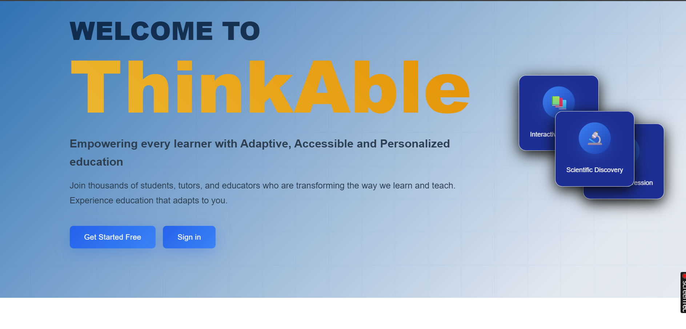

# Thinkable-LMS
#Preview
## 📸 Preview




**Thinkable-LMS** is a modern, full-stack Learning Management System built with **Java Spring Boot** and **React.js**. It allows students, tutors, and administrators to interact efficiently, manage courses, track progress, and gamify learning with achievements.

---

## Features

* User roles: **Admin**, **Tutor**, **Student**
* Course content creation and management
* Student progress tracking
* Achievements and gamification
* Secure authentication and role-based access

---

## Tech Stack

* **Backend:** Java 11+, Spring Boot, Spring Data JPA, Hibernate, H2 Database (for development)
* **Frontend:** React.js, Node.js, npm
* **Build tools:** Maven (backend), npm (frontend)

---

## Getting Started

### Prerequisites

* Java 11+
* Maven 3.6+
* Node.js 18+
* npm 9+

---

### Backend Setup

1. Navigate to the backend folder:

```bash
cd Thinkable-LMS/backend
```

2. Ensure CORS is configured in `src/main/resources/application.properties`:

```properties
cors.allowed.origins=http://localhost:3000
```

3. Run the backend:

```bash
mvn spring-boot:run
```

* Backend runs on **[http://localhost:8080](http://localhost:8080)** by default.

---

### Frontend Setup

1. Navigate to the frontend folder:

```bash
cd Thinkable-LMS/frontend
```

2. Install dependencies:

```bash
npm install
```

3. Start the frontend:

```bash
npm start
```

* Frontend runs on **[http://localhost:3000](http://localhost:3000)** by default.

---

## Project Structure

```
Thinkable-LMS/
├─ backend/           # Spring Boot backend
│  ├─ src/main/java/
│  ├─ src/main/resources/
│  └─ pom.xml
├─ frontend/          # React frontend
│  ├─ src/
│  └─ package.json
└─ README.md
```

---

## Live Demo

* **Frontend:** [http://localhost:3000](http://localhost:3000) (after running frontend)
* **Backend API:** [http://localhost:8080](http://localhost:8080) (after running backend)

*(You can deploy this on platforms like Heroku, Render, or Vercel for live access.)*

---

## Contributing

Contributions are welcome! Please fork the repo, make your changes, and submit a pull request.

